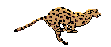

### Cheetah Animation  

This is a small SDL2 Demo and it does demonstrate how to...  

  * create a spritesheet from a gif
  * load that sheet
  * render the spriteframes timed

Useful links:  
[SDL2](https://www.libsdl.org/) [SDL-Discourse](https://discourse.libsdl.org) [Example Code](https://gist.github.com/Acry/baa861b8e370c6eddbb18519c487d9d8)

Assets  
Cheetah: unknown artist.

[Get in touch on SDL-Discourse](https://discourse.libsdl.org/u/Acry/summary)

#### Details:  
[Gif](https://en.wikipedia.org/wiki/GIF) is a pretty old rasterformat with some clever ideas behind, [details](http://giflib.sourceforge.net/whatsinagif/index.html):  

Create Spritesheet:  
`giftext Cheetah.gif`  

[giftext](http://giflib.sourceforge.net/giftext.html) is one of 12 tools from [libgif](http://giflib.sourceforge.net) and gives the info about the delay, it is hundred milliseconds.  
[gifsicle](http://www.lcdf.org/gifsicle/) is an alternative to deal with gif's.
gifsicle --info Cheetah.gif  

Now [ImageMagick](http://imagemagick.org/script/index.php) comes into play:  
Split Gif-Frames  
`convert -coalesce Cheetah-0030.gif out%05d`

Create Sheet:  
`montage out0000[0-7] -tile 4x2 -background transparent gepard_running.png`  

...see the rest in the source.